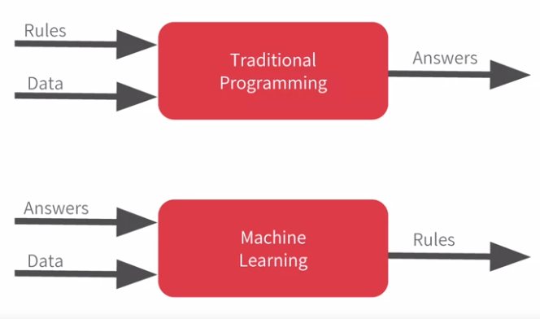

# Week 1
## A new Programming paradigm

A primer in Machine Learning  

  

## The 'Hello World' of neural networks

Using ML, lets try find the equation that solves Y if we have

$X = -1, 0, 1, 2, 3, 4$  
$Y = -3, -1, 1, 3, 5, 7$  
We know that $Y = 2X -1$  
With keras  
```
model = keras.Sequential([keras.layers.Dense(units=1, input_shape=[1])])
model.compile(optimizer='sgd', loss='mean_squared_error')

xs = np.array([-1.0, 0.0, 1.0, 2.0, 3.0, 4.0], dtype=float)
ys = np.array([-3.0, -1.0, 1.0, 3.0, 5.0, 7.0], dtype=float)

model.fit(xs, ys, epochs=500)

print(model.predict([10.0])
```

## Resources
* Let's use Google Colab, you can find a guide on [Intro to Google Colab](https://youtu.be/inN8seMm7UI)


* AI For Everyone is a non-technical course that will help you understand many of the AI technologies we will discuss later in this course, and help you spot opportunities in applying this technology to solve your problems. https://www.deeplearning.ai/ai-for-everyone/
* TensorFlow is available at TensorFlow.org, and video updates from the TensorFlow team are at youtube.com/tensorflow
* Play with a neural network right in the browser at http://playground.tensorflow.org. See if you can figure out the parameters to get the neural network to pattern match to the desired groups. The spiral is particularly challenging!

The 'Hello World' notebook that we used in this course is available on GitHub [here](week1Notebook.ipynb), and the homework [here](exercise1HousePricesPrediction.ipynb)


