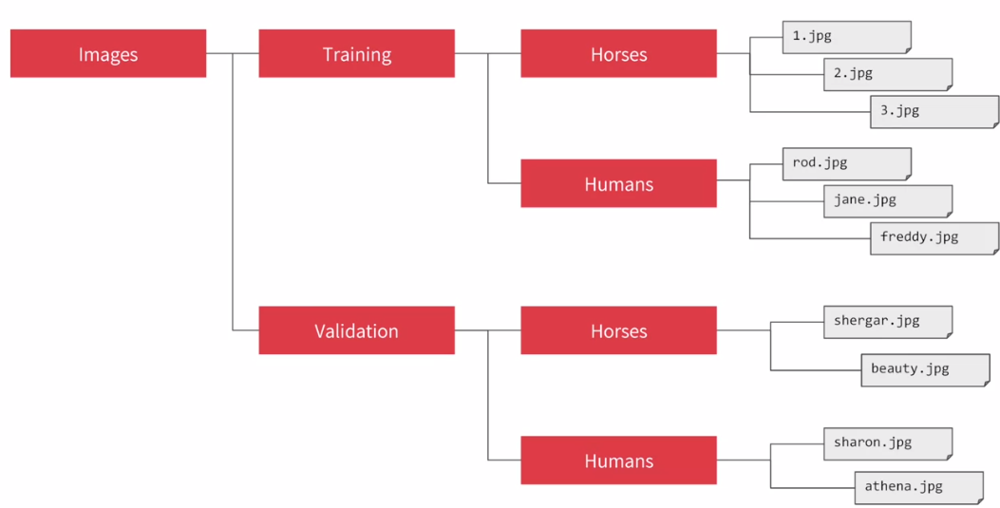
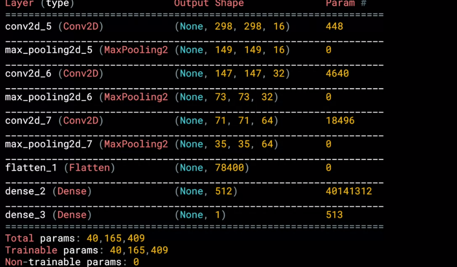

## Understanding ImageGenerator

We are going to look how TF helps us to generate images



```
from tensorflow.keras.preprocessing.image import ImageDataGenerator

train_datagen = ImageDataGenerator(rescale=1./255) # Normalize

train_generator = train_datagen.flow_from_directory(
	traing_dir, # Directory that contains subdirectory with images 
	target_size=(300,300), # images have to have the same size, they are resized if not
	batch_size=128, # Most efficient than one by one
	class_mode='binary' # Choose between just two classes
)
```

## Defining a ConvNet to use complex images

```
model = tf.keras.models.Sequential([
	tf.keras.layers.Conv2D(16, (3,3), activation='relu', input_shape=(300, 300, 3),
	tf.keras.layers.MaxPooling2D(2,2),
	tf.keras.layers.Conv2D(32, (3,3), activation='relu'),
	tf.keras.layers.MaxPooling2D(2,2),
	tf.keras.layers.Conv2D(64, (3,3), activation='relu'),
	tf.keras.layers.MaxPooling2D(2,2),
	tf.keras.layers.Flatten(),
	tf.keras.layers.Dense(512, activation='relu'),
	tf.keras.layers.Dense(1, activation='sigmoid),

])
```
Here a summary of the architecture:



## Training the ConvNet with fit_generator

```
from tensorflow.keras.optimizers import RMSprop

model.compile(loss='binary_crossentropy',
	optimizer=RMSprop(lr=0.001),
	metrics=['acc'])

```
To more details on learning rate go [here](https://youtu.be/zLRB4oupj6g)
```
history = model.fit_generator(
	train_generator,
	steps_per_epoch=8, # batches
	epochs=15,
	validation_data=validation_generator,
	validation_steps=8, # batches
	verbose=2, # way to log into the console
)
```
Predition
```
import numpy as np
from google.colab import files
from keras.preprocessing import image

uploaded = files.upload()

for fn in uploaded.keys():
	path = '/content/' + fn
	img = image.load_img(path, target_size=(300, 300))
	x = image.img_to_array(img)
	x = np.expand_dims(x, axis=0)

	images = np.vstack([x])
	classes = model.predict(images, batch_size=10)
	print(classes[0])
	if classes[0]>0.5:
		print(fn + ' is a human')
	else:
		print(fn + ' is a horse')

```

## Walking through developing a ConvNet

You can have more information about Binary Crossentropy and RMSProp going [here](https://www.youtube.com/watch?v=eqEc66RFY0I&t=6s)

Go [here](https://github.com/jandvanegas/dlaicourse/blob/393039e05c0772e6d70add45212d9e1b3c2686b9/Course%201%20-%20Part%208%20-%20Lesson%202%20-%20Notebook.ipynb) to play with the classifier without validation

Go [here](https://github.com/jandvanegas/dlaicourse/blob/393039e05c0772e6d70add45212d9e1b3c2686b9/Course%201%20-%20Part%208%20-%20Lesson%203%20-%20Notebook.ipynb) to play with a classifier with validation dataset

And [here](https://github.com/jandvanegas/dlaicourse/blob/393039e05c0772e6d70add45212d9e1b3c2686b9/Course%201%20-%20Part%208%20-%20Lesson%204%20-%20Notebook.ipynb) to play with smaller images.


