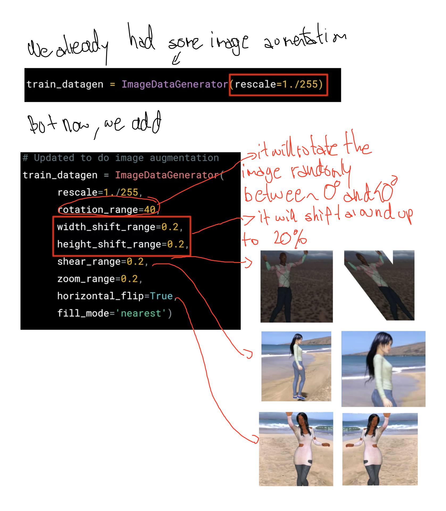

# Week 2
## Augmentation

### Image Augmentation
You'll be looking a lot at Image Augmentation this week.

Image Augmentation is a very simple, but very powerful tool to help you avoid overfitting your data. The concept is very simple though: If you have limited data, then the chances of you having data to match potential future predictions is also limited, and logically, the less data you have, the less chance you have of getting accurate predictions for data that your model hasn't yet seen. To put it simply, if you are training a model to spot cats, and your model has never seen what a cat looks like when lying down, it might not recognize that in future.

Augmentation simply amends your images on-the-fly while training using transforms like rotation. So, it could 'simulate' an image of a cat lying down by rotating a 'standing' cat by 90 degrees. As such you get a cheap way of extending your dataset beyond what you have already.

To learn more about Augmentation, and the available transforms, check out https://github.com/keras-team/keras-preprocessing -- and note that it's referred to as preprocessing for a very powerful reason: that it doesn't require you to edit your raw images, nor does it amend them for you on-disk. It does it in-memory as it's performing the training, allowing you to experiment without impacting your dataset.

### Start Coding...
Ok, now that we've looked at Image Augmentation implementation in Keras, let's dig down into the code.

You can see more about the different APIs at the Keras site here: https://keras.io/preprocessing/image/

[Notebook without augmentation](https://github.com/jandvanegas/dlaicourse/blob/393039e05c0772e6d70add45212d9e1b3c2686b9/Course%202%20-%20Part%204%20-%20Lesson%202%20-%20Notebook%20(Cats%20v%20Dogs%20Augmentation).ipynb)  
[Notebook with augmentation](https://github.com/jandvanegas/dlaicourse/blob/393039e05c0772e6d70add45212d9e1b3c2686b9/Course%202%20-%20Part%204%20-%20Lesson%204%20-%20Notebook.ipynb)