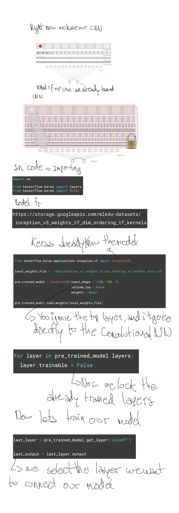
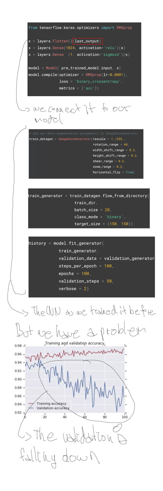
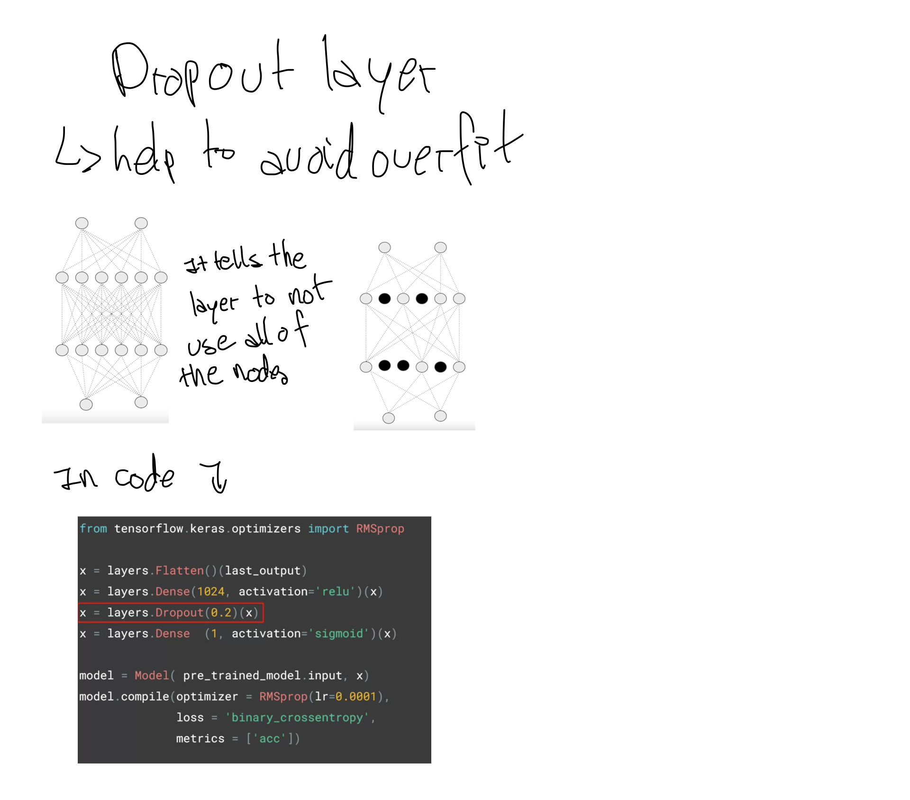

# Week 3
## Transfer Learning

To solve the over fitting 

[Drop out explanation](https://www.youtube.com/watch?v=ARq74QuavAo)
[Here You Can Find The Notebook](https://github.com/jandvanegas/dlaicourse/blob/master/Course%202%20-%20Part%206%20-%20Lesson%203%20-%20Notebook.ipynb)
[Dataset for Horses vs Human](https://www.kaggle.com/sanikamal/horses-or-humans-dataset) 
