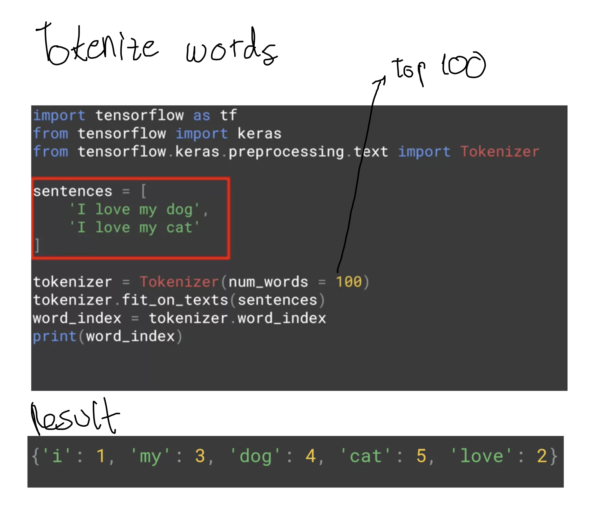
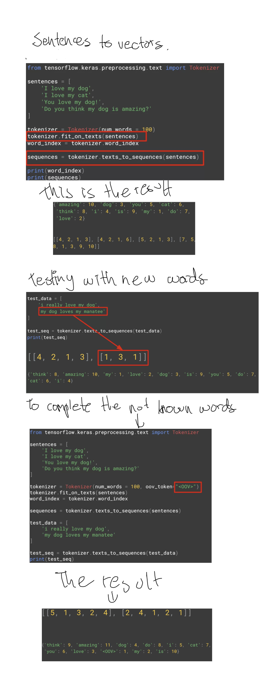
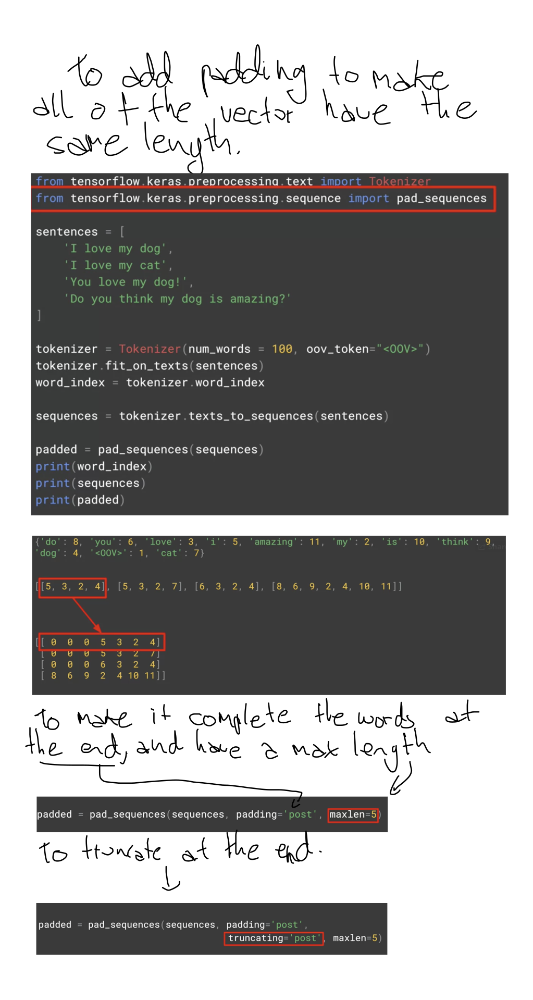

# Week 1
# Sentiment in text

[The Notebook](https://github.com/jandvanegas/dlaicourse/blob/master/TensorFlow%20In%20Practice/Course%203%20-%20NLP/Course%203%20-%20Week%201%20-%20Lesson%201.ipynb)

[The Notebook](https://github.com/jandvanegas/dlaicourse/blob/master/TensorFlow%20In%20Practice/Course%203%20-%20NLP/Course%203%20-%20Week%201%20-%20Lesson%202.ipynb)

## Sarcasm
[Sarcasm Dataset](https://rishabhmisra.github.io/publications/)

[The Notebook] (https://github.com/jandvanegas/dlaicourse/blob/master/TensorFlow%20In%20Practice/Course%203%20-%20NLP/Course%203%20-%20Week%201%20-%20Lesson%203.ipynb)