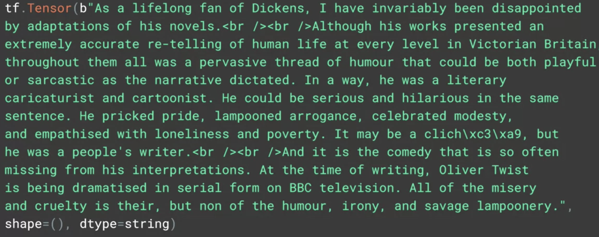
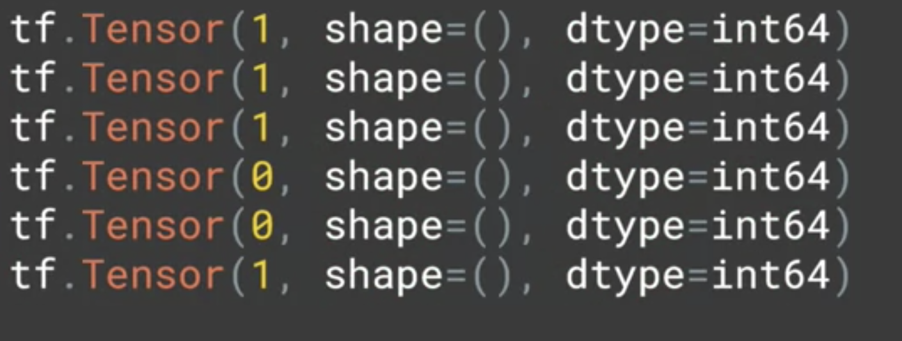
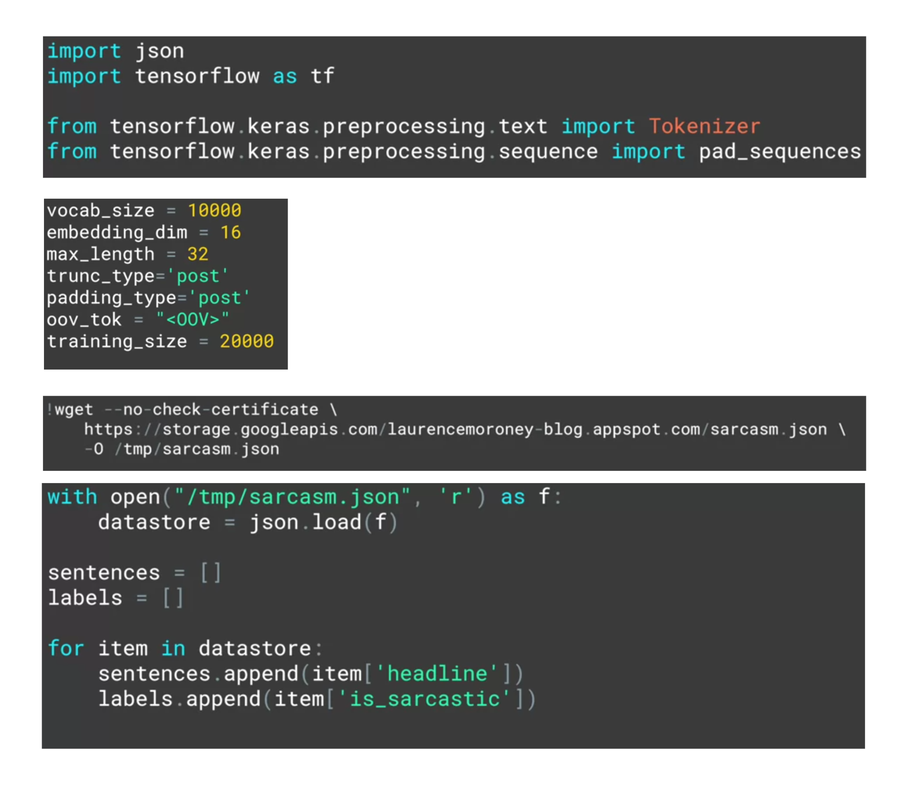
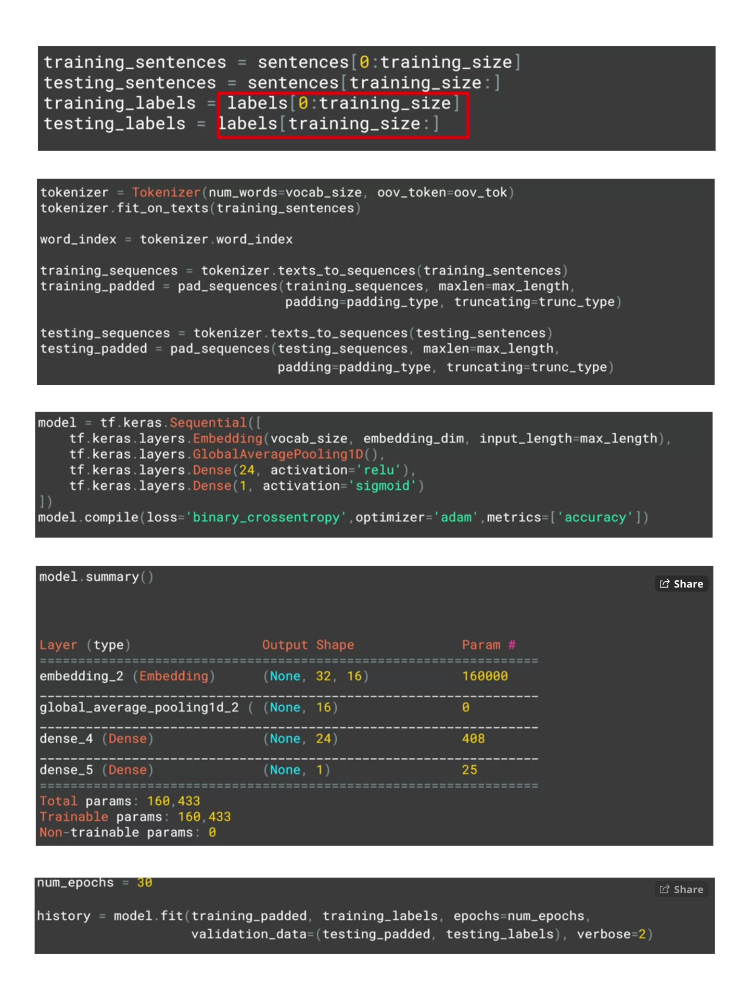
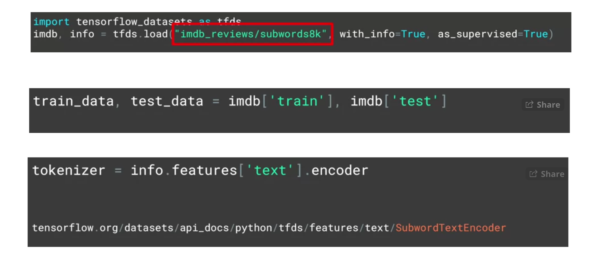
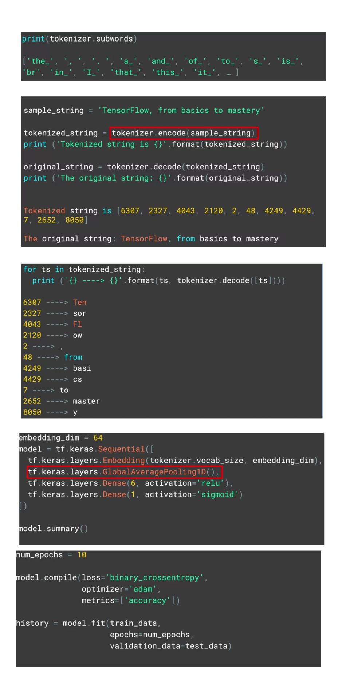

# Week 2
## Word Embeddings

Find the link to he IMDB reviews dataset [here](http://ai.stanford.edu/~amaas/data/sentiment/)

To now what version of TF you have install
```
import tensorflow as tf
print(tf.__version__
```

If you're using 1.2, you'll need to add
```
tf.enable_eager_execution()
```

In google colabs, you can install tf datasets with
```
!pip install -q tensorflow-datasets
```

The code
```
import tensorflow_datasets as tfds
imbd, info = tfds.load('imdb_reviews', with_info=True, as_supervised=True)
```
```
import numpy as np
train_data, test_data = imdb['train'], imdb['test']
```
```
training_sentences = []
training_labels = []

testing_sentences = []
testing_labels = []
# str(s.tonumpy()) is needed in Python3 instead of just s.numpy()
for s, l in train_data:
    training_sentences.append(str(s.numpy()))
    training_labels.append(l.numpy())
for s, l in test_data:
    testing_sentencs.append(str(s.numpy()))
    testing_labels.append(l.numpy())
```

Example of sentence



Example of labels



Convert to numpy array
```
training_labels_final = np.array(training_labels)
testing_labels_final = np.array(testing_labels)
```
Tokenize sentences
```
vocab_size = 10000
embedding_dim = 16
max_lenght = 120
trunc_type = 'post'
oov_tok = '<OOV>'

from tensorflow.keras.preprocessing.text import Tokenizer
from tensorflow.keras.preprocessing.sequence import pad_sequences

tokenizer = Tokenizer(num_words = vocab_size, oov_token=oov_tok)
tokenizer.fit_on_texts(training_sentences)
word_index = tokenizer.word_index
sequences = tokenizer.texts_to_sequences(training_sequences)
padded = pad_sequences(sequences, maxlen=max_length, truncating=trunc_type)

testing_sequences = tokenizer.texts_to_sequences(testing_sequences)
testing_padded = pad_sequences(testing_sequences, maxlen=max_length)
```
Define our NN
```
model = tf.keras.Sequential([
    tf.keras.layers.Embedding(vocab_size, embedding_dim, input_length=max_length),
    tf.keraa.layers.Flatten(),
    tf.keras.layers.Dense(6, activation='relu'),
    tf.keras.layers.Dense(1, activation=sigmoid)
])
```
Compile and summary
```
model.compile(loss='binary_crossentropy', optimizer='adam', metrics=['accuracy'])
model.summary()
```
Training
```
num_epochs = 10
model.fit(padded, training_labels_final, epochs=num_epochs, validation_data=(testing_padded, testing_labels_final))

```
[The Notebook](https://github.com/jandvanegas/dlaicourse/blob/master/TensorFlow%20In%20Practice/Course%203%20-%20NLP/Course%203%20-%20Week%202%20-%20Lesson%201.ipynb)
[Projector of word vectors](http://projector.tensorflow.org/)

## Sarcasm Dataset


[The Notebook](https://github.com/jandvanegas/dlaicourse/blob/master/TensorFlow%20In%20Practice/Course%203%20-%20NLP/Course%203%20-%20Week%202%20-%20Lesson%202.ipynb)
## Pre tokenized datasets
[Dataset](https://github.com/tensorflow/datasets/tree/master/docs/catalog)  
[Dataset Reviews](https://github.com/tensorflow/datasets/blob/master/docs/catalog/imdb_reviews.md)  
[Dataset Documentation](https://github.com/tensorflow/datasets/tree/master/docs/catalog)


[Subwords text encoder](https://www.tensorflow.org/datasets/api_docs/python/tfds/features/text/SubwordTextEncoder)

[The Notebook](https://github.com/jandvanegas/dlaicourse/blob/master/TensorFlow%20In%20Practice/Course%203%20-%20NLP/Course%203%20-%20Week%202%20-%20Lesson%203.ipynb)
