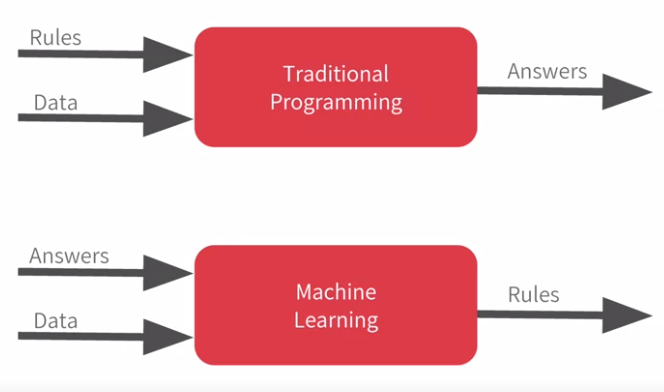

# A new Programming paradigm

A primer in Machine Learning  

  

The 'Hello World' of neural networks

Using ML, lets try find the equation that solves Y if we have

$X = -1, 0, 1, 2, 3, 4$  
$Y = -3, -1, 1, 3, 5, 7$  
We know that $Y = 2X -1$  
With keras  
```
model = keras.Sequential([keras.layers.Dense(units=1, input_shape=[1])])
model.compile(optimizer='sgd', loss='mean_squared_errro')

xs = np.array([-1.0, 0.0, 1.0, 2.0, 3.0, 4.0], dtype=float)
ys = np.array([-3.0, -1.0, 1.0, 3.0, 5.0, 7.0], dtype=float)

model.fit(xs, ys, epochs=500)

print(model.predict([10.0])
```
Let's use Google Colab, you can find a guide on [Intro to Google Colab](https://youtu.be/inN8seMm7UI)

