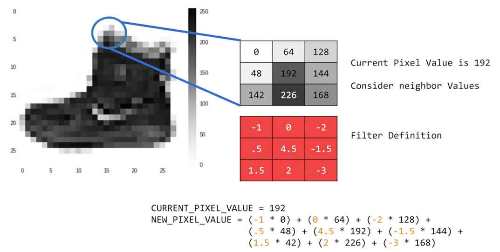
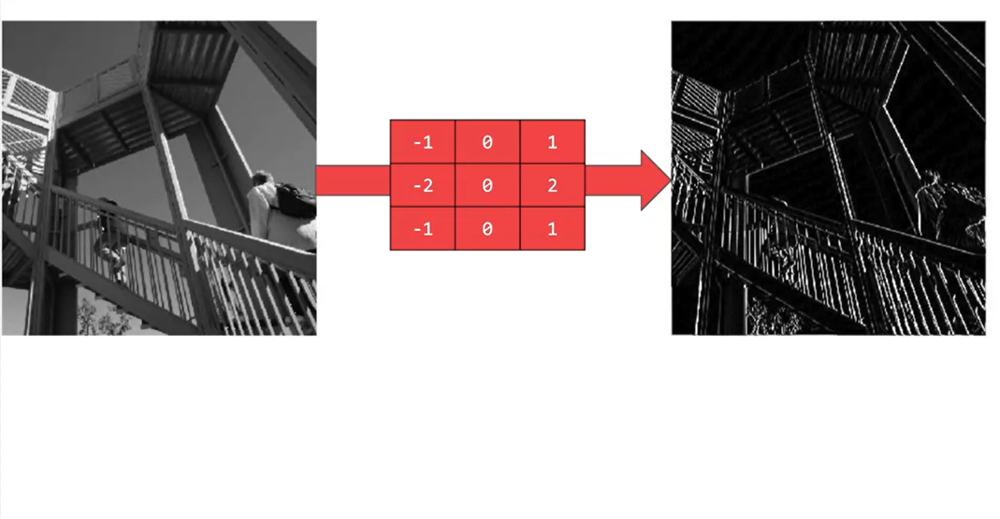
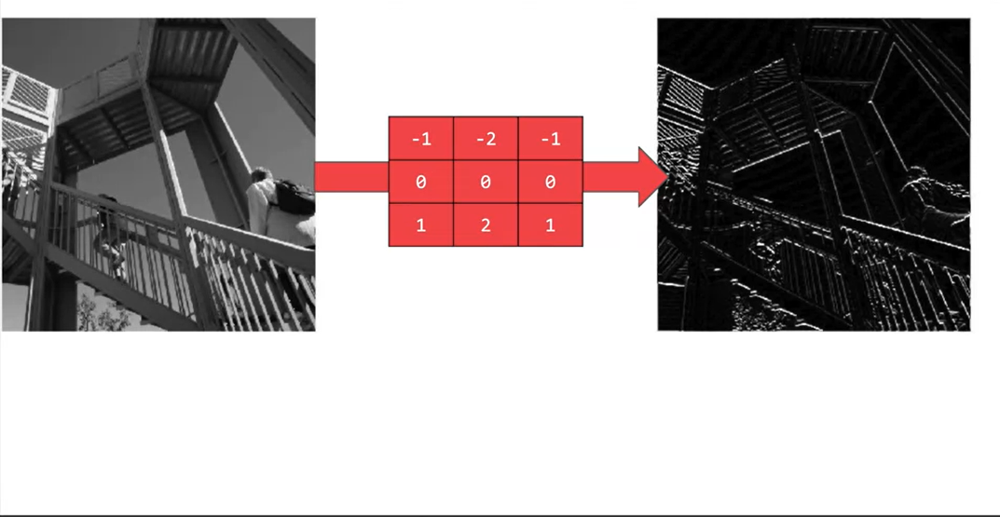
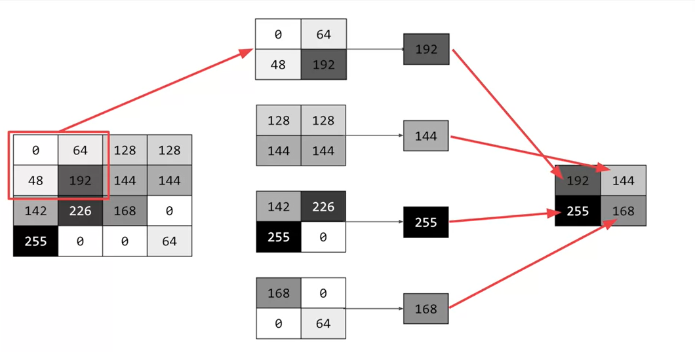
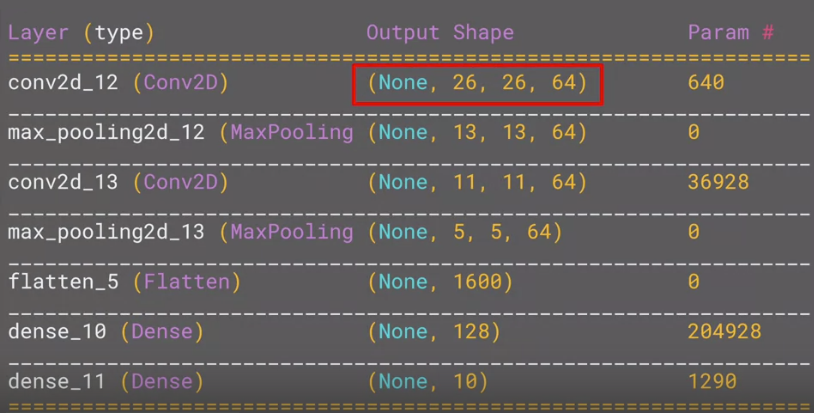

# Week 3
## Convolutional NN



 If you've ever done any kind of image processing, it usually involves having a filter and passing that filter over the image in order to change the underlying image. The process works a little bit like this. For every pixel, take its value, and take a look at the value of its neighbors. If our filter is three by three, then we can take a look at the immediate neighbor, so that you have a corresponding three by three grid. Then to get the new value for the pixel, we simply multiply each neighbor by the corresponding value in the filter.
 
 So, for example, in this case, our pixel has the value 192, and its upper left neighbor has the value zero. The upper left value and the filter is negative one, so we multiply zero by negative one. Then we would do the same for the upper neighbor. Its value is 64 and the corresponding filter value was zero, so we'd multiply those out. Repeat this for each neighbor and each corresponding filter value, and would then have the new pixel with the sum of each of the neighbor values multiplied by the corresponding filter value, and that's a convolution. It's really as simple as that. 

The idea here is that some convolutions will change the image in such a way that certain features in the image get emphasized. So, for example, if you look at this filter, then the vertical lines in the image really pop out.



 With this filter, the horizontal lines pop out.


 
  Now, that's a very basic introduction to what convolutions do, and when combined with something called pooling, they can become really powerful. But simply, pooling is a way of compressing an image. A quick and easy way to do this, is to go over the image of four pixels at a time, i.e, the current pixel and its neighbors underneath and to the right of it. Of these four, pick the biggest value and keep just that. So, for example, you can see it here. 


  
  My 16 pixels on the left are turned into the four pixels on the right, by looking at them in two-by-two grids and picking the biggest value. This will preserve the features that were highlighted by the convolution, while simultaneously quartering the size of the image. We have the horizontal and vertical axes.

## Implementing Convolutional Layers
```
model = tf.keras.models.Sequential([
  # This first layers is asking Keras to generate 64 filters for us. 
  # These filters are 3 by 3, with a 'relu'(throwing away negative values) activation
  # And we have an input 28x28x1(1 means that we're using a single byte for color depth)
  tf.keras.layers.Conv2D(64, (3, 3), activation='relu', input_shape=(28, 28,1)),
  # MaxPooling -> we're going to take the maximun value
  # The pool is 2 by 2, so every 4 pixels, the biggest one will survive
  tf.keras.layers.MaxPooling2D(2, 2),
  tf.keras.layers.Conv2D(64, (3,3), activation='relu'),
  tf.keras.layers.MaxPooling2D(2,2),
  tf.keras.layers.Flatten(),
  tf.keras.layers.Dense(128, activation='relu'),
  tf.keras.layers.Dense(10, activation='softmax')
])

model.summary()
```
From `model.summary()` we get 



The output of the first layers is a 26x26x64 because it cannot start from the first pixel. If we look at the first pixel on the up left corner, we cannot processed it because it doesn't have neighbors to apply the 3x3 filter. It has to move one pixel right and one pixel down. The same for all of the borders. That's why it is 26x26. The 64 are the result of applying the diferent filters.
More details on convolution go [here](https://bit.ly/2UGa7uH)

## Improving the Fashion classifier with convolutions

You can play with this [notebook](https://github.com/jandvanegas/dlaicourse/blob/393039e05c0772e6d70add45212d9e1b3c2686b9/Course%201%20-%20Part%206%20-%20Lesson%202%20-%20Notebook.ipynb) to understand convolutions and pooling better.

To understand convolution better, you can use this [notebook](https://github.com/jandvanegas/dlaicourse/blob/393039e05c0772e6d70add45212d9e1b3c2686b9/Course%201%20-%20Part%206%20-%20Lesson%203%20-%20Notebook.ipynb), and read this [article](https://lodev.org/cgtutor/filtering.html)