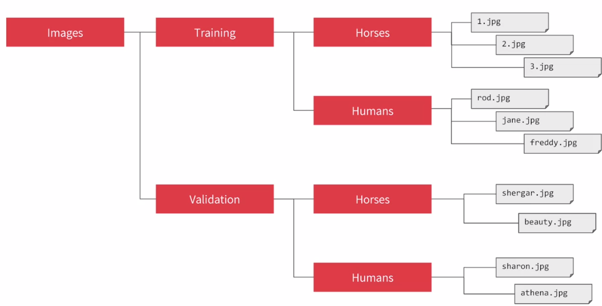

## Understanding ImageGenerator

We are going to look how TF helps us to generate images



```
from tensorflow.keras.preprocessing.image import ImageDataGenerator

train_datagen = ImageDataGenerator(rescale=1./255) # Normalize

train_generator = train_datagen.flow_from_directory(
	traing_dir, # Directory that contains subdirectory with images 
	target_size=(300,300), # images have to have the same size, they are resized if not
	batch_size=128, # Most efficient than one by one
	class_mode='binary' # Choose between just two classes
)
```

## Defining a ConvNet to use complex images


